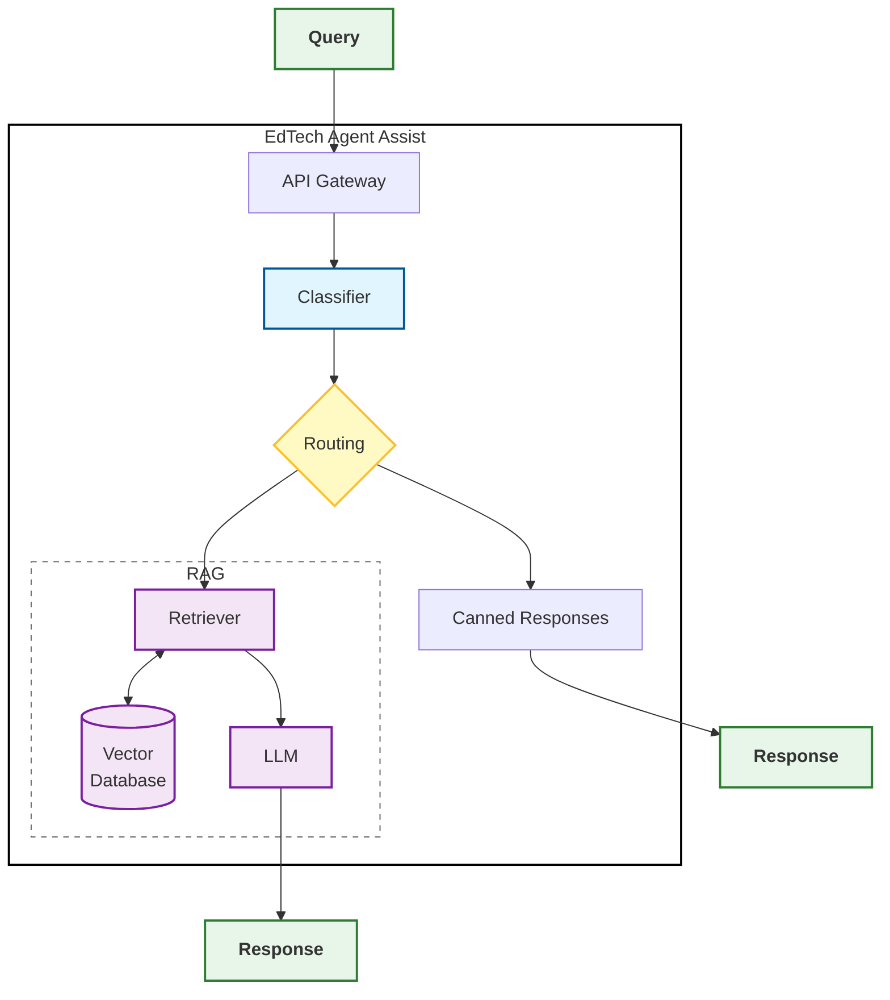

# **1. Декомпозиция (задачи, компоненты, выходы компонентов)**

## **Задачи системы**

**1.** Прием входящих сообщений из различных каналов через единый API-шлюз

**2.** Определение категории запроса (как намерения пользователя) для выбора сценария обработки

**3.** Марщрутизация (выбор пути обработки запроса)

**4.** Поиск релевантной информации по внутренней базе знаний

**5.** Генерация верифициронанного текста ответа (черновик) на основе найденных данных и контекста диалога

**6.** Подкрепление ответа ссылками-источниками из базы знаний для проверки оператором

## **Компоненты системы**

- **API Gateway** - прием запросов из внешних каналов (чаты поддержки, почта, мессенджеры и т.д. и передача их в систему обработки
- **Classifier** - определение категории запроса
- **Routing** - маршрутизация запросов по сценариям (FAQ, RAG, быстрые ответы)
- **Векторное хранилище** - хранение индексированных данных из корпоративной базы знаний
- **Retriever** - поиск релевантного контекста для генерации
- **Canned Responses** - готовые ответы по заранее известным сценариям
- **LLM** - генерация текста ответа для оператора

## **Выходы компонентов**

<table>
    <tr>
        <th>Компонент</th>
        <th>Тип выхода</th>
        <th>Выход компонента</th>
    </tr>
    <tr>
        <td>API Gateway</td>
        <td>Детерминированный</td>
        <td>Структурированный запрос (JSON)</td>
    </tr>
        <td>Classifier</td>
        <td>Вероятностный</td>
        <td>Категория запроса и уровень уверенности (вероятность)</td>
    </tr>
        <td>Routing</td>
        <td>Детерминированный</td>
        <td>Способ обработки</td>
    </tr>
        <td>Retriever</td>
        <td>Вероятностный</td>
        <td>Список наиболее релевантных текстовых фрагментов из базы</td>
    </tr>
        <td>Canned Responsesr</td>
        <td>Детерминированный</td>
        <td>Готовый шаблонный ответ</td>
    </tr>
    <tr>
        <td>LLM</td>
        <td>Вероятностный</td>
        <td>Текст черновика ответа
         Ссылки на источники</td>
    </tr>
</table>

 

# **2. Компнонеты, нуждающиеся в оценке**

<table>
    <tr>
        <th>Компонент</th>
        <th>Соответствующая задача</th>
    </tr>
        <td>Classifier</td>
        <td>Определение категории запроса (намерения пользователя) для выбора сценария обработки</td>
    <tr>
        <td>Retriever</td>
        <td>Поиск релевантной информации по внутренней базе знаний</td>
    <tr>
        <td>LLM</td>
        <td>Генерация верифициронанного текста ответа (черновик) на основе найденных данных и контекста диалога
          Подкрепление ответа ссылками-источниками из базы знаний для быстрой проверки оператором</td>
    </tr>
</table>

(+ выходы данных компонентов)

Остальные (детерминированные) компоненты не нуждаются в регулярной оценке.
