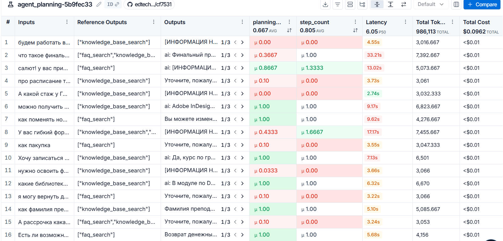

# **Оценка качества агента**

## **Сценарий использования**

Агент в системе используется после этапа работы классификатора (роутера): для формирования ответов только на запросы, требующие смысловой обработки, т.е. исключая односложные приветствия/благодарности, спам и опционально другие категории, на которые выдаются шаблонные ответы или нужна быстрая эскалация оператору.

На выбор агента предоставлено 2 инструмента (ретриверы):

- поиск среди часто задаваемых вопросов (общие регламенты/ошибки/процедуры платформы) (`faq_search`);
- поиск по базе знаний (контекст для ответа на сложные вопросы) (`knowledge_base_search`).

Если информации для поиска недостаточно (вопрос абстрактный), агент должен в качестве черновика сформулирвоать уточняющий вопрос.

## **Метрики (оценка планирования и эффективность)**

Для оценки использовался набор данных формата **(запрос, набор инструментов)**, размеченный вручную.

Для оценки работы агента используется гибридный подход, сочетающий точную проверку и анализ с помощью LLM-as-a-Judge. Это позволяет не только фиксировать ошибки, но и понимать их причину (например, избыточное уточнение вместо поиска).

1. **Оценка планирования (LLM-as-a-Judge)**: Основная метрика, оценивает качество планирования по шкале от 0.0 до 1.0.

- Точная оценка сразу засчитывает 1.0, если список инструментов совпал с эталоном.
- В случае расхождений подключается LLM-судья, который анализирует контекст: был ли лишний инструмент вызван как «подстраховка» (балл снижается незначительно) или агент ушел в уточнение, проигнорировав обязательный поиск (балл снижается существенно).

2. **Метрики эффективности**:

- Среднее число шагов на задачу: Количественная метрика, фиксирующая число вызовов инструментов (шагов) на одну задачу.

_Примечание: В данном сценарии большинство задач должно решаться за 1 шаг (вызов одного подходящего инструмента). Рост этой метрики (например, до 3–4 шагов) при сохранении высокой оценки планирования сигнализирует о том, что агент делает лишние вызовы или ретриверы возвращают пустые ответы, заставляя агента перебирать инструменты._

Дополнительно автоматически отслеживаются:

- Latency: среднее время выполнения.
- Cost: средняя стоимость на задачу.

## **Анализ результатов и возможные улучшения**

**Результаты оценки**:

**Значения показателей**

- Оценка планирования (planning_logic) = 0.67 (среднее)
- Среднее число шагов на задачу (step_count) = 0.81 (среднее)
- Средняя стоимость на задачу ~= $0.0005
- Среднее время выполнения (медиана) = 6 сек

Общий анализ указывает на слабую способность агента следовать инструкциям в части обязательного использования инструментов. Агент склонен к преждевременным уточнениям, к повторному вызову одного инструмента, даже если тот возвращает информацию или к вызову неверного инструмента без проверочного вызова второго.

**Анализ задержек**
В ходе тестирования выявлены задачи с аномально высоким временем выполнения (15–30 сек.). Это может быть связано с:

- повторным вызовом инструментов;
- длительным поиском по базе знаний при сложных запросах;
- временными задержками на стороне провайдеров моделей или сетевыми ожиданиями при передаче больших контекстов.

**Типизация ошибок планирования**

Ниже представлены основные типы ошибок, выделенные в ходе детального анализа прогонов с оценкой планирования ниже 1.0:

1. Уточнения для явных, но общих вопросов без вызова инструментов (на уровне промпта указано, что уточнение нужно формировать только для общего, но "размытого" вопроса)
2. Вызов неверного инстурмента с пустым результатом без дополнительного (проверочного) вызова второго.
3. Отсутствие вызова инстурмента и отсутствие уточняющего вопроса.
4. Повторный вызов (2-3 раза) одного и того же инструмента с изменением формулировки запроса (возвращается один и тот же результат).

Данные ошибки характерны для определенных запросов. За k=3 прогонов повторяются в 2-3 случаях: за редким исключением агент выбирает правильный сценарий.

Оценка планирования не связана с оценкой генерации и выходами ретриверов.

**Возможные улучшения**: ссновным направлением будет корректировка и доработка промпта.
