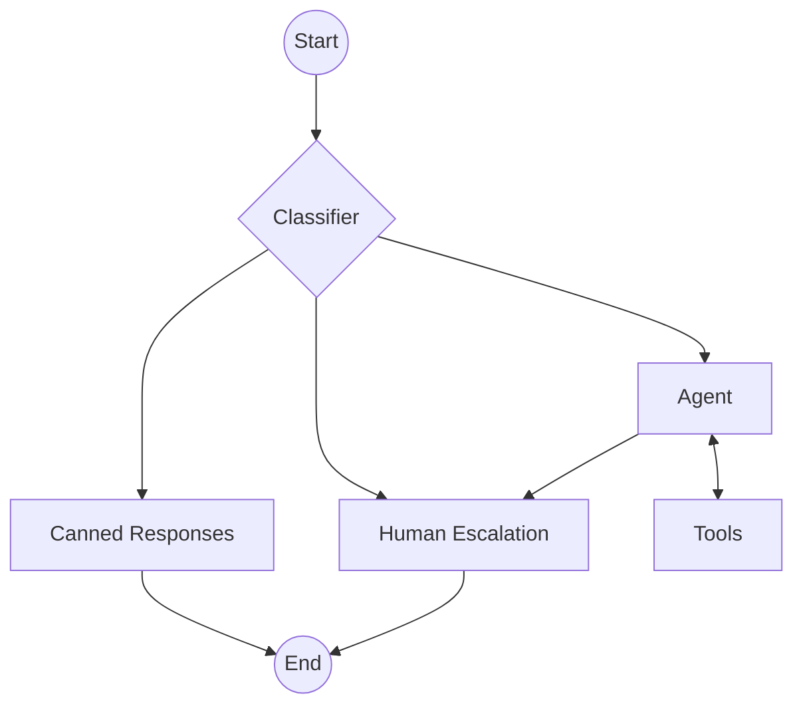
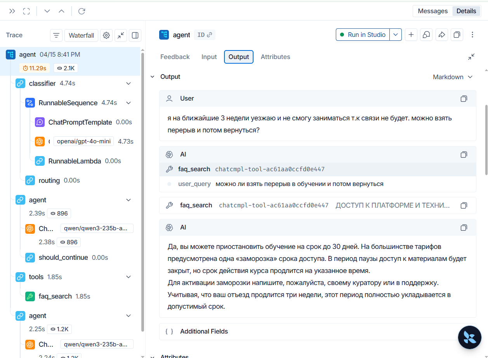
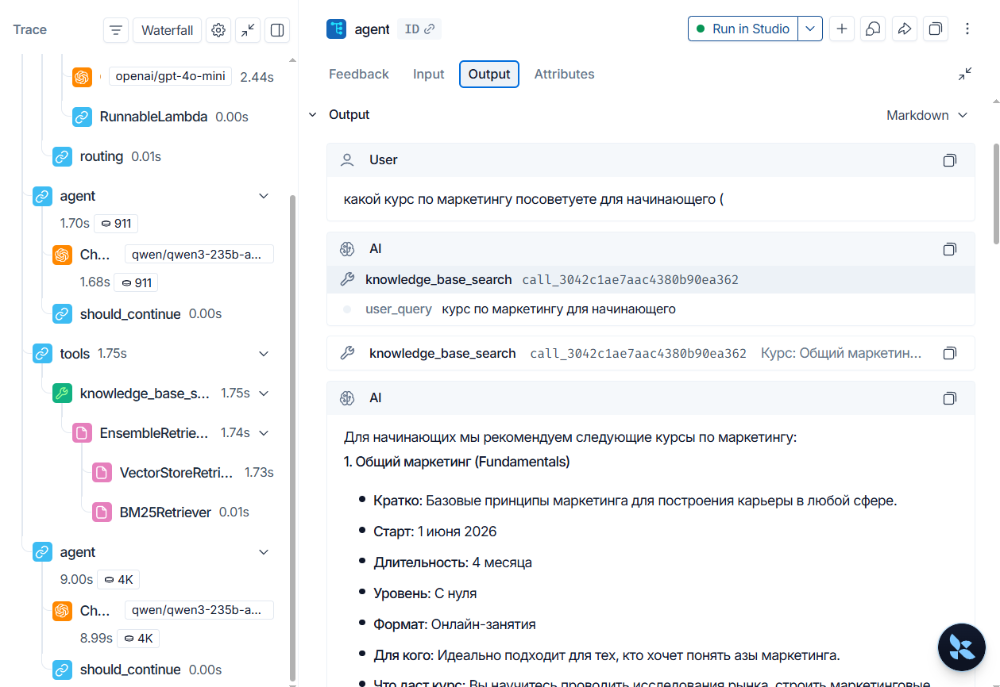

# **Выбор инструментов для агента**

## **Сценарий использования и среда**

Агент в системе используется после этапа работы классификатора (роутера): для формирования ответов только на запросы, требующие смысловой обработки, т.е. исключая односложные приветствия/благодарности, спам и опционально другие категории, на которые выдаются шаблонные ответы или нужна быстрая эскалация оператору.

**Задача агента** - формирование черновика ответа на основе фактов, соответствующих внутренним регламентам платформы либо, в случае если данных недостаточно, - уточняющего вопроса.

Таким образом **средой агента** будем считать внутреннюю базу знаний платформы, т.е подготовленное информационное пространство, позволяющее агенту выполнять свою задачу.

## **Инструменты**

<table>
    <tr>
        <th>Инструмент</th>
        <th>Тип</th>
        <th>Назначение</th>
        <th>Вход</th>
        <th>Выход</th>
    </tr>
    <tr>
        <th>KnowledgeBaseSearch (RAG)</th>
        <td>Ретривер (инструмент чтения)</td>
        <td>Предоставление контекста для генерации</td>
        <td>Запрос пользователя + метаданные</td>
        <td>Список документов с указанием ссылок на исходник / "Информации не найдено"</td>
    </tr>
    <tr>
        <th>FAQSearch</th>
        <td>Ретривер (инструмент чтения)</td>
        <td>Поиск по базе точных соответствий (официальные правила)</td>
        <td>Запрос пользователя + метаданные</td>
        <td>Утвержденный текст / "Информации не найдено"</td>
    </tr>
</table>

## **Описание рисков, политик использования и Human-in-the-Loop**

**Риски и политики использования**:

1. Галлюцинации: риск того, что агент сгенерирует убедительный, но ложный ответ при отсутствии информации в базе знаний

- Политика использования: строгий запрет на генерацию утвердительного ответа, если инструменты вернули пустой результат или результат с низким коэффициентом релевантности. В такой ситуации агент обязан уточнить вопрос.

2. Конфликт источников знаний: ситуация, когда информация в FAQ противоречит данным из базы знаний (RAG)

- Политика использования: Иерархия источников. При обнаружении противоречий агент обязан отдавать приоритет источнику с более высоким статусом.

**Human-in-the-Loop**

В архитектуре системы уже предусмотрена роль человека: оператор выступает в роли финального валидатора, который проверяет не только текст черновика, но и соответствие прикрепленных ссылок-источников сути ответа. Исправления, вносимые оператором вручную, логируются системой для последующего анализа качества работы системы.

## **Демонстрация работы агента (вызов инструментов)**

**Примечание**: Фиксация вызова инструментов проводилась автоматически с использованием LangSmith.
В данном сценарии HITL сымитирован через прерывание выполнения графа перед соответствующим узлом графа (см. обнолвенную схему выше) с возможностью ручного ввода финального ответа. В рамках оценки работы агента как планировщика инструментов участие человека не применяется, так как проверяется только корректность маршрутизации и выбора инструментов, а валидация финального ответа выполняется автоматически без отката к предыдущим шагам.

### **Инструмент** `faq_search`

### **Инструмент** `knowledge_base_search`

