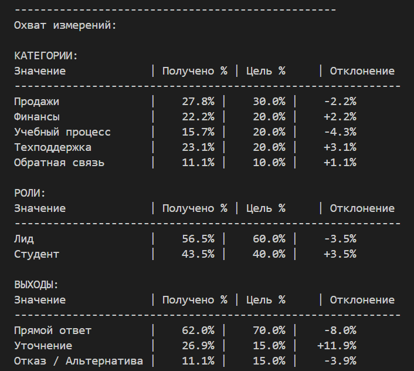

# **Проектирование датасета для оценки AI-системы**

## **1. Задача и функциональные требования системы**

**Задача системы:** обработка обращений пользователей для ускорения работы службы поддержки за счет автоматического поиска информации и подготовки готовых черновиков ответов для операторов.

Система должна выполнять следующие **функции**:

- автоматическое определение категории запроса для его правильной маршрутизации и фильтрации;
- поиск информации по базе знаний, соответсвующий запросу пользователя;
- генерация ответов на основе истории диалога и данных из базы знаний (соответствие контексту пользователя).

## **2. Измерения разнообразия данных**

В данной системе функциональные возможности являются сквозными и задействованы в каждом запросе (общая логика работы). Поэтому при формировании измерений сделаем упор на сценарии, с которыми может столкнуться система, и роли пользователей.
Шаблонные запросы: приветствия, спам, благодарности будут генерироваться отдельно от общего пайплайна для (т.к. обрабатываются только классификатором)

<table>
    <tr>
        <th>Измерение</th>
        <th>Зачения</th>
        <th>Целевые пропорции</th>
    </tr>
        <td>Роли</td>
        <td>Потенциальный пользователь (Лид) Студент платформы</td>
        <td>60% 40%</td>
    <tr>
        <td>Категории</td>
        <td>Продажи Финансы Учебный процесс Техподдержка Обратная связь</td>
        <td>30% 20% 20% 20% 10%</td>
    <tr>
        <td>Ожидаемый результат</td>
        <td>Прямой ответ по базе Уточнение Обработка несоответствия (отказ / альтернатива)</td>
        <td>70% 15% 15%</td>
    </tr>
</table>

## **3. Стратегия генерации данных**

**Выбранная стратегия:** Синтетическая генерация (с привязкой к реальным данным из базы знаний).

Данный подход является наиболее предпочтительным, так как позволяет создавать новые сценарии «с нуля», исходя из заданных измерений. В отличие от аугментации, которая лишь видоизменяет уже существующие примеры, синтез обеспечивает гораздо большее разнообразие и позволяет покрыть редкие или критические ситуации, которых еще нет в истории обращений. Привязка к реальным правилам платформы позволит сделать данные более достоверными, избавит от необходимости иметь большой объем данных для старта и выявить сценарий отказов системы, которые не всегда возможно предусмотреть заранее.

## **4. Итоговая статистика**

**Общее число сгенерированных примеров: 108**

